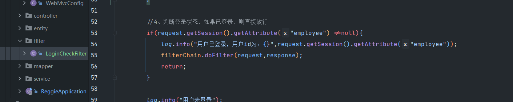
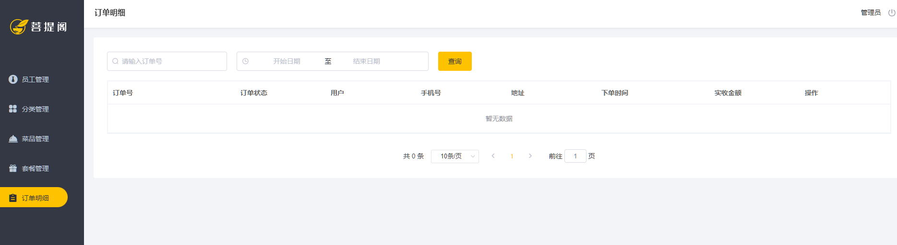
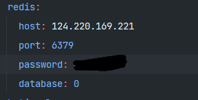

 # 一、错误原因

在配置过滤器的时候从session中拿去用户写错，employee写成emplooyee



# 二、错误信息

&emsp;&emsp; 在整理增加异常是，写错错误信息contains方法中包含Duplicate  entry中间有空格


# 三、前端更改

1. 做分页查询时：前端页面的最大分页不光显示要改，vue里面的初值也要更改


2. 后端在书写时要判断搜索的name是不是问空，因为isNotEmpty被舍弃的，isNotEmpty过时了，所以学会了新的方法hasTest，此方法判断字符串 不是 null ，并且不为空，而且不能是空白字符，只有这三个条件同时满足时才 返回 true ，其他情况均返回 false
   + 也可以使用import org.apache.commons.lang.StringUtils;这个包的isNotEmpty方法

3. 前端vue中，分页需要的数据records和total是从后端分页插件中传送过来的


4. 修改员工状态，因为是雪花算法生成的ID所以js在解析的时候会丢失精度所以需要引入对象映射器

```java
import com.fasterxml.jackson.databind.DeserializationFeature;
import com.fasterxml.jackson.databind.ObjectMapper;
import com.fasterxml.jackson.databind.module.SimpleModule;
import com.fasterxml.jackson.databind.ser.std.ToStringSerializer;
import com.fasterxml.jackson.datatype.jsr310.deser.LocalDateDeserializer;
import com.fasterxml.jackson.datatype.jsr310.deser.LocalDateTimeDeserializer;
import com.fasterxml.jackson.datatype.jsr310.deser.LocalTimeDeserializer;
import com.fasterxml.jackson.datatype.jsr310.ser.LocalDateSerializer;
import com.fasterxml.jackson.datatype.jsr310.ser.LocalDateTimeSerializer;
import com.fasterxml.jackson.datatype.jsr310.ser.LocalTimeSerializer;
import java.math.BigInteger;
import java.time.LocalDate;
import java.time.LocalDateTime;
import java.time.LocalTime;
import java.time.format.DateTimeFormatter;
import static com.fasterxml.jackson.databind.DeserializationFeature.FAIL_ON_UNKNOWN_PROPERTIES;

/**
 * 对象映射器:基于jackson将Java对象转为json，或者将json转为Java对象
 * 将JSON解析为Java对象的过程称为 [从JSON反序列化Java对象]
 * 从Java对象生成JSON的过程称为 [序列化Java对象到JSON]
 */
public class JacksonObjectMapper extends ObjectMapper {

    public static final String DEFAULT_DATE_FORMAT = "yyyy-MM-dd";
    public static final String DEFAULT_DATE_TIME_FORMAT = "yyyy-MM-dd HH:mm:ss";
    public static final String DEFAULT_TIME_FORMAT = "HH:mm:ss";

    public JacksonObjectMapper() {
        super();
        //收到未知属性时不报异常
        this.configure(FAIL_ON_UNKNOWN_PROPERTIES, false);

        //反序列化时，属性不存在的兼容处理
        this.getDeserializationConfig().withoutFeatures(DeserializationFeature.FAIL_ON_UNKNOWN_PROPERTIES);


        SimpleModule simpleModule = new SimpleModule()
                .addDeserializer(LocalDateTime.class, new LocalDateTimeDeserializer(DateTimeFormatter.ofPattern(DEFAULT_DATE_TIME_FORMAT)))
                .addDeserializer(LocalDate.class, new LocalDateDeserializer(DateTimeFormatter.ofPattern(DEFAULT_DATE_FORMAT)))
                .addDeserializer(LocalTime.class, new LocalTimeDeserializer(DateTimeFormatter.ofPattern(DEFAULT_TIME_FORMAT)))

                .addSerializer(BigInteger.class, ToStringSerializer.instance)
                .addSerializer(Long.class, ToStringSerializer.instance)
                .addSerializer(LocalDateTime.class, new LocalDateTimeSerializer(DateTimeFormatter.ofPattern(DEFAULT_DATE_TIME_FORMAT)))
                .addSerializer(LocalDate.class, new LocalDateSerializer(DateTimeFormatter.ofPattern(DEFAULT_DATE_FORMAT)))
                .addSerializer(LocalTime.class, new LocalTimeSerializer(DateTimeFormatter.ofPattern(DEFAULT_TIME_FORMAT)));

        //注册功能模块 例如，可以添加自定义序列化器和反序列化器
        this.registerModule(simpleModule);
    }
}
```

然后拓展mvc的框架，加入消息转换器 


# 四、公共字段填充

1. 删除掉原本的公共字段


2. 创建公共填充的类


3. 基于ThreadLocal封装工具类，用户保存和获取当前登录用户id，在同一次调用中，线程是同一个


**<font color="red" >注：要提取为公共字段，应该先给要提取的字段加上</font>**'
> @TableField注解
 

4. bug  提取公共字段时：update_user为空异常，原因是书写的线程路径没有起到作用

没有跳转到提取公共字段的类里，改正方法暂无（可能因为主启动类没有写@ServletComponentScan注解，待测试---测试完成，情况属实）。


# 五、 分类管理

+ 分类管理时，因为套餐没有增加查询条件所以，删除一直失败


+ 把查询出来的条件增加进去


# 六、 文件上传时

    1）.必须采用post方式提交数据，method=”post”;
    2）.必须用multipart格式上传文件，enctype=”multipart/form-data”；
    3）.使用input的file控件上传，type=”file”；
    4）.指定文件路径时，最后加\\

    5）.在写上传文件的代码时，参数传递必须使file
    6.. 下载文件关闭流时，最好放在finally中，不管程序出没出现异常都可以正常关闭，节省资源

**<font color="red" size="5">注菜品管理的删除，批量删除，停售，起售待开发</font>**


# 七、套餐管理

+ 因为要操作两个表，所以要开启事务管理


+ 写完新增套餐的主题逻辑之后，测试发现菜品不能回显


+ 要在菜品管理的controller里完善新增套餐的请求


+ 因为菜品有个售卖转态，所以再查询的时候也要添加上查询当前售卖转态 


+ 套餐管理中的分页查询返回的是那个代理对象，因为要返回套餐的名字


+ 删除套餐中，因为id是长整形要用Long接受
**注：泛型中不能用基本数据类型所以要用Long来接受，虚拟机在编译时会把带泛型的转换成Object类型，而基本数据类型不属于Object 所以不能装**


**<font color="red" size="5">注：套餐中的修改，停售，起售待开发</font>**


# 八、客户端开发

## 1.邮件登录
+ 在pom中导入commons-email
+ 添加邮件发送的工具类
```java
package cn.org.sqx.reggie.utils;

import org.apache.commons.mail.HtmlEmail;

public class EmailUtils {
    public int sendAuthCodeEmail(String email) {
        try {
            HtmlEmail mail = new HtmlEmail();
            /*发送邮件的服务器 126邮箱为smtp.126.com,163邮箱为163.smtp.com，QQ为smtp.qq.com*/
            mail.setHostName("smtp.163.com");
            /*不设置发送的消息有可能是乱码*/
            mail.setCharset("UTF-8");
            /*IMAP/SMTP服务的密码*/
            mail.setAuthentication("发送消息的邮箱如：mejhrgx@qq.com", "密码");
            /*发送邮件的邮箱和发件人*/
            mail.setFrom("发件邮箱：mejhrgx@qq.com", "发件人:三千星");
            /*使用安全链接*/
            mail.setSSLOnConnect(true);
            /*接收的邮箱*/
            mail.addTo("mejhrgx@163.com");
            /*验证码*/
            Integer code = ValidateCodeUtils.generateValidateCode(4);
            /*设置邮件的主题*/
            mail.setSubject("注册验证码");
            /*设置邮件的内容*/
            mail.setMsg("尊敬的用户:你好! 注册验证码为:" + code + "(有效期为一分钟)");
            mail.send();//发送
        } catch (Exception e) {
            return 0;
        }
        return 1;
    }
}
```
<br></br>
+ ValidateCodeUtils是生成验证码的工具类
```java
package cn.org.sqx.reggie.utils;

import java.util.Random;

/**
 * 随机生成验证码工具类
 */
public class ValidateCodeUtils {
    /**
     * 随机生成验证码
     * @param length 长度为4位或者6位
     * @return
     */
    public static Integer generateValidateCode(int length){
        Integer code =null;
        if(length == 4){
            code = new Random().nextInt(9999);//生成随机数，最大为9999
            if(code < 1000){
                code = code + 1000;//保证随机数为4位数字
            }
        }else if(length == 6){
            code = new Random().nextInt(999999);//生成随机数，最大为999999
            if(code < 100000){
                code = code + 100000;//保证随机数为6位数字
            }
        }else{
            throw new RuntimeException("只能生成4位或6位数字验证码");
        }
        return code;
    }

    /**
     * 随机生成指定长度字符串验证码
     * @param length 长度
     * @return
     */
    public static String generateValidateCode4String(int length){
        Random rdm = new Random();
        String hash1 = Integer.toHexString(rdm.nextInt());
        String capstr = hash1.substring(0, length);
        return capstr;
    }
}

```

+ 邮箱登录bug中，待修复


# 九、

+ 阿里云短信服务
    + 导入依赖
>      <dependency>
        <groupId>com.aliyun</groupId>
            <artifactId>aliyun-java-sdk-core</artifactId>
            <version>4.6.0</version>
        </dependency>

        <dependency>
            <groupId>com.aliyun</groupId>
            <artifactId>aliyun-java-sdk-dysmsapi</artifactId>
            <version>2.2.1</version>
        </dependency>
+ 导入发送短信的工具类 

```java
import com.aliyuncs.DefaultAcsClient;
import com.aliyuncs.IAcsClient;
import com.aliyuncs.dysmsapi.model.v20170525.SendSmsRequest;
import com.aliyuncs.dysmsapi.model.v20170525.SendSmsResponse;
import com.aliyuncs.exceptions.ClientException;
import com.aliyuncs.profile.DefaultProfile;

/**
 * 短信发送工具类
 */
public class SMSUtils {

    /**
     * 发送短信
     * @param signName 签名
     * @param templateCode 模板
     * @param phoneNumbers 手机号
     * @param param 参数
     */
    public static void sendMessage(String signName, String templateCode,String phoneNumbers,String param){
        DefaultProfile profile = DefaultProfile.getProfile("cn-hangzhou", "", "");
        IAcsClient client = new DefaultAcsClient(profile);

        SendSmsRequest request = new SendSmsRequest();
        request.setSysRegionId("cn-hangzhou");
        request.setPhoneNumbers(phoneNumbers);
        request.setSignName(signName);
        request.setTemplateCode(templateCode);
        request.setTemplateParam("{\"code\":\""+param+"\"}");
        try {
            SendSmsResponse response = client.getAcsResponse(request);
            System.out.println("短信发送成功");
        }catch (ClientException e) {
            e.printStackTrace();
        }
    }
}
```

+ 在控制层调用，发送短信消息

**<font color="red">注：邮箱登录的bug，可能是因为没有设置好拦截器的问题，待全面开发完成后，测试，版本回退之后，前面的邮箱验证须重新书写</font>**

## 用户登录 
前端未知bug，不发送登录请求，接口异常


拦截器问题，因为没有登录所以直接登录页面，死循环中，所以请求发送失败。


登录成功之后，没有页面效果是因为要发送两次请求
http://localhost:8080/category/list 和 http://localhost:8080/shoppingCart/list
因为  http://localhost:8080/shoppingCart/list 的后端接口还没写所以菜品显示失败。可以先把前端页面发送的请求调整一下


登录之后图片没有展示

因为在配置文件中没有写图片路径,把图片路径写上，在把图片复制到路径里面，就好了，和前面套餐哪里，图片没有回显一样


# 十、购物车功能

购物车里面的钱数，需要调用数据库来计算，不能使用前端传递过来的，因为可能存在安全问题
购物车bug，只有设置了默认地址之后，才可以正常结算，不然会调到保存地址的页面

购物车提交之后，清空数据库中的信息


# 十一、订单明细

待开发



# 十二、redis环境

配置pom文件中的依赖

```
dependency>
    <groupId>org.springframework.boot</groupId>
    <artifactId>spring-boot-starter-data-redis</artifactId>
</dependency>
```

在配置文件中配置redis



创建配置类

```
@Configuration
public class RedisConfig extends CachingConfigurerSupport {
    @Bean
    public RedisTemplate<Object, Object> redisTemplate(RedisConnectionFactory connectionFactory) {
        RedisTemplate<Object, Object> redisTemplate = new RedisTemplate<>();
        //默认的Key序列化器为：JdkSerializationRedisSerializer
        redisTemplate.setKeySerializer(new StringRedisSerializer());
        redisTemplate.setConnectionFactory(connectionFactory);
        return redisTemplate;
    }
}
```

应为默认的序列化器使用的话可能出现问题，所以需要自己创建


